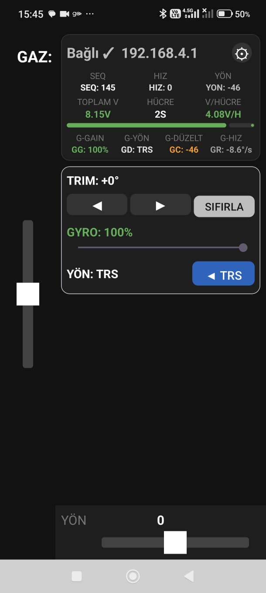

# RC Transmitter Android

Android based RC transmitter application for the ESP32 RC receiver project.

Main receiver firmware repository:

👉 https://github.com/failsmakes/RC-Receiver-ESP

This application turns an Android phone or tablet into a wireless RC transmitter for DIY RC vehicles, robots and custom ESP32 based projects.

The app communicates with the ESP32 receiver over WiFi and provides a customizable touch-based control interface.

---

# Designed for the MakerZ Project


👉 https://www.printables.com/model/1722018
👉 https://cad.onshape.com/documents/7d9962a6c5298b518856c9ab

# Features

* Android based RC transmitter
* Touch joystick controls
* ESP32 receiver support
* WiFi communication
* Low latency control
* Simple and lightweight interface
* Open-source project

---

# Supported Hardware

Compatible with the receiver firmware available here:

👉 https://github.com/failsmakes/RC-Receiver-ESP

Can be used with:

* RC cars
* RC boats
* DIY robots
* Custom ESP32 projects
* Robotics platforms

---

# Screenshots



---

# How It Works

1. Upload the receiver firmware to the ESP32 board
2. Power the receiver hardware
3. Connect the Android device to the receiver WiFi network
4. Launch the Android transmitter app
5. Start controlling your RC vehicle

---

# Android Requirements

* Android 7.0 or newer recommended
* WiFi capable device
* Touchscreen support

---

# Project Structure

* Android Studio project files
* Source code
* Assets
* Gradle configuration
* UI resources

---

# Building the App

Clone the repository:

```bash
git clone https://github.com/failsmakes/RC-Transmitter-Android.git
```

Open the project using:

* Android Studio

Build and run the application on your Android device.

---

# Future Improvements

Planned features may include:

* Bluetooth support
* More channels
* Custom channel mapping
* OTA firmware updates
* Multi-model profiles

---

# License

This project is open-source and available under the MIT License unless otherwise specified.

---

# Contributing

Pull requests, bug reports and feature suggestions are welcome.

If you improve the project, feel free to contribute.

---

# Author


Fails&Makes

YouTube:
https://www.youtube.com/@failsmakes

GitHub:
https://github.com/failsmakes

---
